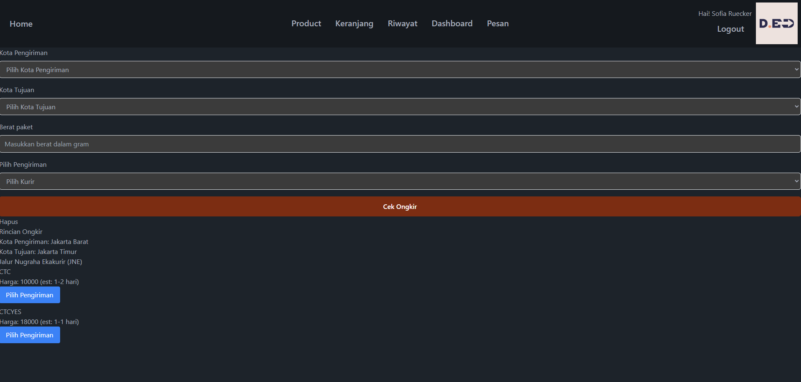

# Toko Baju Online

## Fitur

-   CRUD Admin: Deskripsi fitur CRUD admin.
-   Responsive Mobile: Deskripsi fitur responsif mobile.
-   Menggunakan API Raja Ongkir: Deskripsi penggunaan API Raja Ongkir.
-   Menggunakan API Midtrans untuk Transaksi: Deskripsi penggunaan API Midtrans untuk transaksi.

## Gambar

Anda dapat menampilkan gambar dalam bentuk daftar :

### Daftar Gambar

1. 
2. 
3. 
4. 
5. 
6. 
7. 
8. 

Atau Anda dapat menggunakan galeri:

## Instalasi

Untuk menginstal proyek ini, ikuti langkah-langkah berikut:

1. Clone repositori ini ke dalam direktori lokal Anda:

    ```bash
    git clone https://github.com/haycalrh21/tokobajuonline.git
    ```

2. Masuk ke direktori proyek:

    ```bash
    cd tokobajuonline
    ```

3. Install dependensi PHP menggunakan Composer:

    ```bash
    composer install
    ```

4. Install dependensi JavaScript menggunakan npm:

    ```bash
    npm install
    ```

## Penggunaan

-   php artisan migrate
-   php artisan db=seed --class=AdminSeeder
-   php artisan serve
-   npm run dev

## Kontak

hrayhansyah@gmail.com
